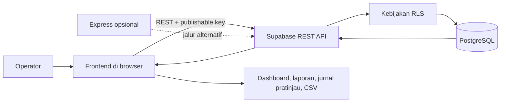
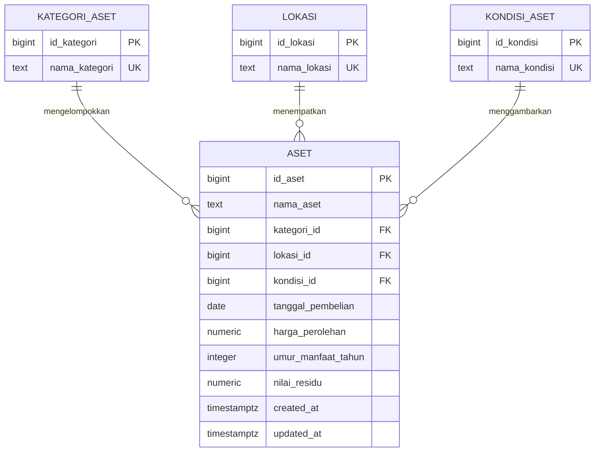

<div align="center">

# FEBRINA-ASSET

**Sistem Informasi Pencatatan Aset Tetap**  
Inventaris, penyusutan, dan pelaporan aset Febrina's Catering.


</div>

## Tentang Proyek

FEBRINA-ASSET adalah aplikasi web untuk mencatat dan memantau aset tetap Febrina's Catering. Data aset tersimpan di PostgreSQL melalui Supabase, dengan referensi kategori, lokasi, dan kondisi.

> **Cakupan akuntansi:** laporan penyusutan dan jurnal yang tersedia adalah hasil perhitungan serta pratinjau di browser. Jurnal belum disimpan ke database atau diposting ke buku besar.

## Daftar Isi

- [Fitur](#fitur)
- [Teknologi dan Arsitektur](#teknologi-dan-arsitektur)
- [Menjalankan Aplikasi](#menjalankan-aplikasi)
- [ERD](#erd)
- [Backend Express Opsional](#backend-express-opsional)
- [Perhitungan Penyusutan](#perhitungan-penyusutan)
- [Keamanan dan Batasan](#keamanan-dan-batasan)
- [Struktur Proyek](#struktur-proyek)
- [Dokumentasi](#dokumentasi)

## Fitur

- Mencatat, mengubah, dan menghapus aset tetap.
- Menampilkan kategori, lokasi, kondisi, tanggal pembelian, dan harga perolehan.
- Mencari aset serta memfilter berdasarkan kondisi.
- Menandai aset yang rusak atau memerlukan perbaikan.
- Menghitung penyusutan garis lurus dan estimasi nilai buku jika umur manfaat sudah diisi.
- Menampilkan laporan aset dan penyusutan berdasarkan periode bulanan yang dipilih.
- Menampilkan serta mencetak pratinjau jurnal penyusutan dengan total debit dan kredit.
- Mengekspor aset yang sedang ditampilkan ke CSV.

## Teknologi dan Arsitektur

- **Frontend:** HTML, CSS, JavaScript.
- **Database dan API utama:** Supabase, PostgreSQL, Supabase REST API.
- **Backend alternatif:** Node.js, Express, `@supabase/supabase-js`.

Frontend saat ini mengakses Supabase secara langsung. Backend Express tersedia sebagai jalur alternatif, tetapi belum digunakan oleh frontend.



Data aset tersimpan di database. Kalkulasi dashboard/laporan/jurnal, pencarian, filter, dan ekspor CSV dilakukan di browser.

## Menjalankan Aplikasi

1. Buat proyek Supabase dan buka **SQL Editor**.
2. Jalankan seluruh isi `backend/sql/database.sql` untuk membuat tabel, kebijakan akses, indeks, dan data referensi awal.
3. Skrip yang sama menambahkan kolom penyusutan yang belum ada pada database lama dan dapat dijalankan ulang untuk skema aplikasi ini.
4. Pastikan URL proyek dan publishable key tersedia untuk konfigurasi frontend.

Tabel utama:

- `aset`: data aset dan foreign key kategori, lokasi, serta kondisi.
- `kategori_aset`: daftar kategori.
- `lokasi`: daftar lokasi aset.
- `kondisi_aset`: daftar kondisi aset.

Kolom penyusutan pada `aset` adalah `umur_manfaat_tahun` dan `nilai_residu`. Nilai residu tidak boleh negatif atau melebihi harga perolehan. Umur manfaat, jika diisi, harus antara 1 dan 100 tahun.

## ERD



Setiap aset wajib memiliki satu kategori, satu lokasi, dan satu kondisi. Satu record referensi dapat dipakai banyak aset atau belum dipakai. Relasi menggunakan `ON UPDATE CASCADE` dan `ON DELETE RESTRICT`.

### Jalankan Frontend

Atur `SUPABASE_URL` dan `SUPABASE_PUBLISHABLE_KEY` di bagian konfigurasi `frontend/js/script.js` sesuai proyek Supabase Anda. Gunakan publishable key, bukan service-role key.

Sajikan folder `frontend` menggunakan server web statis. Contoh jika Node.js tersedia:

```powershell
npx serve frontend
```

Buka URL lokal yang ditampilkan server. Anda juga dapat memakai ekstensi server statis di VS Code. Membuka HTML melalui `file://` tidak disarankan karena perilaku permintaan browser dapat berbeda.

### Backend Express Opsional

Backend hanya diperlukan jika aplikasi akan diarahkan untuk menggunakan endpoint Express. Siapkan Node.js, instal dependensi dari root proyek, lalu atur variabel lingkungan Supabase:

```powershell
npm init -y
npm install express @supabase/supabase-js
$env:SUPABASE_URL = 'https://PROJECT-REF.supabase.co'
$env:SUPABASE_SERVICE_ROLE_KEY = 'ISI_DI_ENVIRONMENT_SERVER'
node backend/app.js
```

Server berjalan pada port `3000` secara default; atur `PORT` untuk menggunakan port lain. Endpoint yang tersedia:

- `GET /api/referensi`
- `GET /api/aset`
- `POST /api/aset`
- `PATCH /api/aset/:id`
- `DELETE /api/aset/:id`

> **Penting:** service-role key memiliki hak akses tinggi. Simpan hanya di environment server, jangan masukkan ke frontend atau commit ke repositori. Frontend saat ini belum memanggil endpoint Express.

API Express saat ini hanya memvalidasi dan menyimpan atribut dasar aset. Untuk pengalaman lengkap (termasuk umur manfaat dan nilai residu), gunakan integrasi Supabase REST yang saat ini dipakai frontend, atau perluas API Express sebelum mengalihkan frontend ke sana.

## Perhitungan Penyusutan

Perhitungan dilakukan di browser dan merupakan estimasi berdasarkan tanggal saat halaman dibuka:

```text
Dasar penyusutan = harga perolehan - nilai residu
Penyusutan per bulan = dasar penyusutan / (umur manfaat dalam tahun x 12)
Nilai buku = harga perolehan - akumulasi penyusutan
```

Tanpa umur manfaat, nilai penyusutan dan nilai buku tidak ditampilkan. Laporan dapat ditampilkan untuk bulan yang dipilih dan dicetak. Pratinjau jurnal menghitung beban periode dari perubahan akumulasi penyusutan antara akhir bulan sebelumnya dan akhir bulan terpilih; penyusutan dimulai pada bulan setelah pembelian.

Jurnal debit Beban Penyusutan dan kredit Akumulasi Penyusutan dibuat sementara di browser. Jurnal tersebut hanya pratinjau yang dapat dicetak: tidak tersimpan di database dan tidak diposting ke buku besar.

## Keamanan dan Batasan

- Kebijakan pada `backend/sql/database.sql` saat ini memberikan role Supabase `anon` akses baca ke tabel referensi dan akses CRUD ke tabel aset. Artinya, akses belum dibatasi berdasarkan akun pengguna. Tinjau dan persempit kebijakan Row Level Security (RLS) sebelum memakai data produksi.
- Aplikasi menyediakan inventaris, laporan aset/penyusutan, dan pratinjau jurnal; belum menyediakan penyimpanan/posting jurnal, buku besar, pemasok, bukti pembelian, persetujuan, atau laporan keuangan menyeluruh.

## Struktur Proyek

```text
backend/
├── app.js
└── sql/
    └── database.sql
frontend/
├── css/
│   └── style.css
├── html/
│   └── index.html
└── js/
    └── script.js
README.md
Deskripsi_SIA_Pencatatan_Aset_Tetap_Febrinas_Catering.docx
Laporan_UTS_Pencatatan_Aset_Tetap_Febrinas_Catering.pdf
```

## Dokumentasi

- [Deskripsi sistem, skema, flowchart, dan ERD (DOCX)](Deskripsi_SIA_Pencatatan_Aset_Tetap_Febrinas_Catering.docx)
- [Laporan UTS (PDF)](Laporan_UTS_Pencatatan_Aset_Tetap_Febrinas_Catering.pdf)
